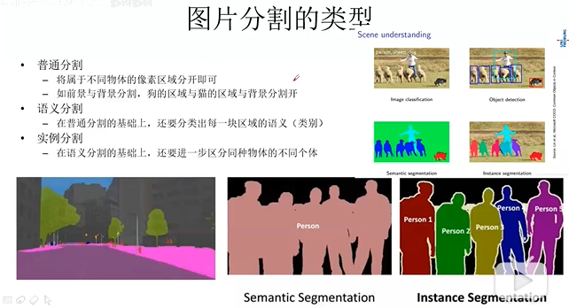
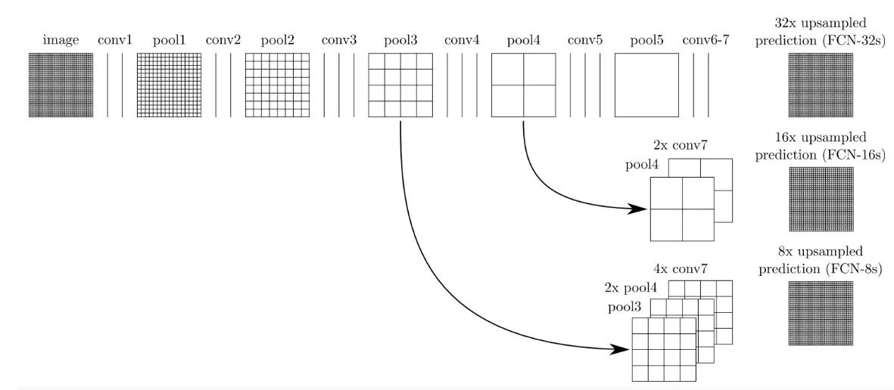
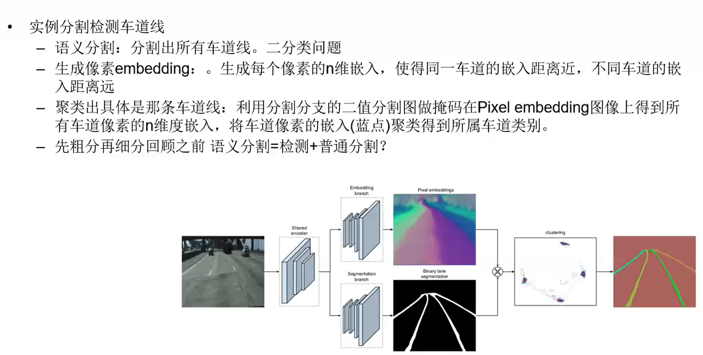

# 计算机视觉任务

> DCNN能够很好的处理的图像级别的分类问题，因为它具有很好的平移不变性（空间细节信息已高度抽象）


- 分类
- 定位
- 目标检测
- 图像分割


# 图像分割

- 普通分割
  将不同分属不同物体的像素区域分开。 
  如前景与后景分割开，狗的区域与猫的区域与背景分割开。

- 语义分割
  在普通分割的基础上，分类出每一块区域的语义（即这块区域是什么物体）。 
  如把画面中的所有物体都指出它们各自的类别。

- 实例分割
  在语义分割的基础上，给每个物体编号。 
  如这个是该画面中的狗A，那个是画面中的狗B。



## 语义分割

|     网络      |   基于    |           增加的结构           |       优势       | 劣势 |
| :-----------: | :-------: | :----------------------------: | :--------------: | :--: |
|      FCN      |   VGG16   |            Deconv层            |       简单       | 粗糙 |
|    SegNet     | DeconvNet |            反池化层            |                  |      |
| U-net、Unet++ |    FCN    |                                |   简单、性能好   |      |
| DeepLabV1、2  |    FCN    |      膨胀卷积、CRF、ASPP       |      性能好      | 复杂 |
|   DeepLabV3   |           |                                |      性能好      | 复杂 |
|  DeepLabV3++  |           |     可分离卷积 应用到ASPP      | 计算量小、性能好 | 复杂 |
|    PSP-Net    |           |        pyramid pooling         |   简单、性能好   |      |
|   RefineNet   |   U-net   | Long-range Residual Connection |      性能好      |      |
|    FastFCN    |  DeepLab  |              JPU               | 计算量小、性能好 |      |
|      ...      |           |                                |                  |      |

### FCN


- crop层：裁剪
- eltwise层：[类似Concat层](CSDN-专业IT技术社区-登录)

```
举例：3维RGB图(384*384*3)->[卷积下采样]->高维heatmap(6*6*1000)->[反卷积上采样]->原图像素语义分割(384*384*21)
```

> FCN相比于CNN：
> CNN：
> 1.CNN的全连接层失去了原始输入图像中的空间信息，从而不能做像素级分类。
> 2.CNN网络在一张更大的输入图片上滑动，需要运行多次。
> FCN：
> 1.FCN采用反卷积层对最后一个卷积层的feature map进行上采样, 使它恢复到输入图像相同的尺寸，从而可以对每个像素都产生了一个预测，同时保留了原始输入图像中的空间信息, 最后在上采样的特征图上进行逐像素分类。
> 2.FCN无论输入多大的图片，FCN在单个向前传播的过程中完成上述的操作，并得到多个输出。

**跳级结构**


如下图所示：对原图进行卷积conv1、pool1后图像缩小为1/2；对图像进行第二次卷积conv2、pool2后图像缩小为1/4；对图像进行第三次卷积conv3、pool3后图像缩小为1/8，此时保留pool3的featuremap；对图像进行第四次卷积conv4、pool4后图像缩小为1/16，此时保留pool4的featuremap；对图像进行第五次卷积conv5、pool5后图像缩小为1/32，然后把原来CNN操作过程中的全连接编程卷积操作的conv6、conv7，图像的featuremap的大小依然为原图的1/32,此时图像不再叫feature map而是叫heat map。



其实直接使用前两种结构就已经可以得到结果了，这个上采样是通过反卷积（deconvolution）实现的，对第五层的输出（32倍放大）反卷积到原图大小。但是得到的结果还上不不够精确，一些细节无法恢复。于是将第四层的输出和第三层的输出也依次反卷积，分别需要16倍和8倍上采样，结果过也更精细一些了。这种做法的好处是兼顾了local和global信息。


### Unet网络

> 对于一个网络模型来说，我个人认为，主要看的是：**网络模型提出的背景、网络模型的结构、网络模型的训练以及结果、网络模型的应用和缺陷不足。**
>
> ##### 背景
>
> 先引入涉及的处理问题以建立的基础:**图像分割**
>  图像分割，简单来说就是给出一张图像，分割出图像的中所需物体的一个完整准确的轮廓，其实也就相当于现实中的“抠图”。如下图，就是图像的分割。
>
> 
>
> 实现图像分割的方法有很多，这边只叙述一下unet的建立基础
>
> FCN（全卷积网络）
>
> 先上图，如下所示：
>
> 
>
> 网络的整体结构分为：全卷积部分和反卷积部分。
>
> 全卷积部分：借用了一些经典的CNN网络并把最后的全连接层换成卷积，用于提取特征，形成热点图；
>
> 反卷积部分：将小尺寸的热点图上采样得到原尺寸的语义分割图像。
>
> 简单来说，
>
> 就是将原本CNN过程中最后的 Fully Connected 换成了卷积，直接输出目标物体所属的像素范围。
>
> FCN的主要技术
>
> 1.卷积化（Convolutional）
>
> 全连接层（6,7,8）都变成卷积层，适应任意尺寸输入，输出低分辨率的分割图片。为什么要把全连接层变为卷积层？【
>
> 当我们输入的图片大小和卷积核大小一致时，其实等价于建立全连接，但是还是有区别。
>
> 全连接的结构是固定的，当我们训练完时每个连接都是有权重的。而卷积过程我们其实为训练连接结构，学习了目标和那些像素之间有关系，权重较弱的像素我们可以忽略。连接不会学习过滤，会给每个连接分权重并不会修改连接关系。卷积则是会学习有用的关系，没用得到关系它会弱化或者直接 dropout。这样卷积块可以共用一套权重，减少重复计算，还可以降低模型复杂度。】
>
> 2.上采样（Upsample)
>
> 上采样指的是任何可以让图像变成更高分辨率的技术。最简单的方式是重采样和插值：将输入图片进行rescale到一个想要的尺寸，而且计算每个点的像素点，使用如双线性插值等插值方法对其余点进行插值来完成上采样过程。
>
> 
>
> 3.跳跃结构（Skip Layer）
>
> 如果利用之前提到的上采样技巧对最后一层的特征图进行上采样的到原图大小的分割，由于最后一层的特征图太小，我们会损失很多细节。因而作者提出增加Skips结构将最后一层的预测（有更富的全局信息）和更浅层（有更多的局部细节）的预测结合起来，这样可以在遵守全局预测的同时进行局部预测。
>
> 
>
> 三个技术都已构建模型之中，通过一定标记数据的训练后，模型已经学会了如何识别类别，并且能反卷积得到对应类别所在的像素区域。输出的效果如下：
>
> 
>
> 总的来说：FCN对图像进行
>
> 像素级的分类
>
> ，从而解决了语义级别的图像分割问题。与经典的CNN在卷积层之后使用全连接层得到固定长度的特征向量进行分类（全联接层＋softmax输出）不同，FCN可以接受任意尺寸的输入图像，采用反卷积层对最后一个卷积层的feature map进行上采样, 使它恢复到输入图像相同的尺寸，从而可以对每个像素都产生了一个预测, 同时保留了原始输入图像中的空间信息, 最后在上采样的特征图上进行逐像素分类。
>
> 这部分可参考：
>
> 全卷积网络 FCN 详解
>
> 这里不详细展开
>
> 重点看看在FCN基础上改进的unet
>
> 网络结构如下：
>
> 
>
> 详解：
>
> 1.输入是572x572的，但是输出变成了388x388，这说明经过网络以后，输出的结果和原图不是完全对应的，这在计算loss和输出结果都可以得到体现。
>
> 2.蓝色箭头代表3x3的卷积操作，并且stride是1，padding策略是vaild，因此，每个该操作以后，featuremap的大小会减2。
>
> 3.红色箭头代表2x2的maxpooling操作，需要注意的是，此时的padding策略也是vaild（same 策略会在边缘填充0，保证featuremap的每个值都会被取到，vaild会忽略掉不能进行下去的pooling操作，而不是进行填充），这就会导致如果pooling之前featuremap的大小是奇数，那么就会损失一些信息 。
>
> 4.绿色箭头代表2x2的反卷积操作，这个只要理解了反卷积操作，就没什么问题，操作会将featuremap的大小乘2。
>
> 5.灰色箭头表示复制和剪切操作，可以发现，在同一层左边的最后一层要比右边的第一层要大一些，这就导致了，想要利用浅层的feature，就要进行一些剪切，也导致了最终的输出是输入的中心某个区域。
>
> 6.输出的最后一层，使用了1x1的卷积层做了分类。
>
> 
>
> U-net网络比较简单，前半部分也就是图中左边部分的作用是**特征提取**，后半部分也就是图中的右边部分是上采样。
>  在一些文献中也把这样的结构叫做编码器-解码器结构。由于此网络整体结构类似于大写的英文字母U，故得名U-net。
>  U-net与其他常见的分割网络有一点非常不同的地方：**U-net采用了完全不同的特征融合方式：拼接，U-net采用将特征在channel维度拼接在一起，形成更厚的特征。而FCN融合时使用的对应点相加，并不形成更厚的特征。**
>  总结一下：U-net建立在FCN的网络架构上，作者修改并扩大了这个网络框架，使其能够使用很少的训练图像就得到很 精确的分割结果。添加上采样阶段，并且添加了很多的特征通道，允许更多的原图像纹理的信息在高分辨率的layers中进行传播。U-net没有FC层，且全程使用valid来进行卷积，这样的话可以保证分割的结果都是基于没有缺失的上下文特征得到的，因此输入输出的图像尺寸不太一样
>
> Unet可以较好地应用在医学图像领域，具体可参考如下：
>  [Unet神经网络为什么会在医学图像分割表现好？](简书)
>  其余应用：
>
> 
>
> 

### DeepLab系列

作者发现Deep Convolutional Neural Networks (DCNNs) 能够很好的处理的图像级别的分类问题，因为它具有很好的平移不变性（空间细节信息已高度抽象），但是DCNNs很难处理像素级别的分类问题，例如姿态估计和语义分割，它们需要准确的位置信息。

#### V1、V2

1.DCNNs中语义分割存在三个挑战：

- 连续下采样和重复池化，导致最后特征图分辨率低
- 图像中存在多尺度的物体`（和v1不同之处）`
- 空间不变性导致细节信息丢失

2.处理方案：

- 移除部分池化操作，使用空洞卷积`（后来都叫膨胀卷积）`
- 利用不同膨胀因子的空洞卷积融合多尺度信息—atrous spatial pyramid pooling(ASPP)`（和v1不同之处）`
- Fully-connected Conditional Random Field(CRF)

3.优势

- 速度很快，DCNN 8fps，CRF需要0.5秒
- 准确率高，当时在PASCAL VOC 2012、PASCAL-Context、PASCAL- Person-Part、Cityscapes效果最好`（实验数据集更多）`
- 结构简单，DCNN和CRF的组合

#### 空洞卷积（膨胀卷积）


> 空洞卷积（又称atrous算法）的由来：https://www.jianshu.com/p/295dcc4008b4
>
> - 为防止输出结果尺寸太小，导致最后特征图分辨率太低，FCN的作者在第一层直接对原图加了100的padding，但是会引入噪声；
> - 还有办法是减少池化层，但是这样做改变了原来网络的结构，不能复用旧模型的参数来微调训练了；
> - 通过在普通卷积核中插入几个空洞，使相同情况下感受野更大，这样可以掌握更多的全局信息，这在语义分割中很重要
>
> 例如：卷积核3x3，插入一个空洞之后，视野是5x5


膨胀卷积有两种实现方式：

- 上采样反卷积核，参数之间插入`r-1`个`0`。例如`K`大小的卷积核上采样之后大小为`k+(k-1)(r-1)`
- 下采样卷积核，隔行去采样产生`r平方`个子特征图，然后正常卷积，最后插值返回输入大小的分别率。`（当你发现随着膨胀因子增大，网络训练时间增加的很快时，不用怀疑底层实现肯定是这样的）`

#### ASPP结构**

作者尝试了两种方案物体多尺度问题：

- 通过resize多尺度输入图片，最终结果取对象像素点位置最大的响应结果。
- 受R-CNN的spatial pyramid pooling(SPP)启发，得到ASPP结构。
   具体结构如图所示：


通过不同的rate构建不同感受野的卷积核，用来获取多尺度物体信息。

#### 条件随机场（CRF）

> Fully-connected Conditional Random Field (CRF)
>
> 主要利用CRF来优化物体细节信息，并且此处是全连接CRF。

在基于深度学习的语义图像分割体系结构,CRF是一个有用的**后处理模块**，但是主要缺点是不能将其用作端到端体系结构的一部分。在标准CRF模型中，可以表示成对电位用加权高斯函数的和。但是由于精确的极小化是否考虑了CRF分布的平均场近似用一个简单的产品版本来表示发行版独立的边际分布。**它的平均场近似原生形式不适合反向传播。** 

#### V3概述

1.DCNNs中语义分割存在三个挑战：

- 连续下采用和重复池化，导致最后特征图分辨率低
- 图像中存在多尺度的物体
   `注：当前版本没有使用CRF`

2.作者把解决多尺度物体问题的方法分成**四类**：


(a)把输入图片缩放成不同尺度，经过同一个网络，最终融合多尺度下的物体信息

(b)使用编解码结构，在decoder时融合encoder网络不同阶段的特征

(c)在原网络最后层增加额外的context模块，比如DenseCRF，或者串联几个不同感受野的卷积模块

(d)在原网络最后层添加并行结构—空间金字塔池化，获取不同尺度的物体信息

3.作者的处理方案：

- 使用空洞卷积，防止分辨率过低情况
- 串联不同膨胀率的空洞卷积或者并行不同膨胀率的空洞卷积（v2的ASPP），来获取更多上下文信息

4.优势

- 当时在PASCAL VOC 2012 test上效果最好，并且没有使用DenseCRF

5.本文主要工作

- 探索更深结构下的空洞卷积探索（串行结构）
- 优化atrous spatial pyramid pooling—ASPP（并行结构）

#### V3+概述

#### encoder-decoder结构

**在语义分割任务中，spatial pyramid pooling module（SPP）可以捕获更多尺度信息，encoder-decoder结构可以更好恢复物体的边缘信息。**

作者主要工作：

1.原DeepLabv3当作encoder，添加decoder得到新的模型（DeepLabv3+）。

如下图所示，作者把spatial pyramid pooling module和Encoder-Decoder融合成一体：


2.把`Xception`和`Depthwise separable convolution`应用到`Atrous Spatial Pyramid Pooling`和`decoder`中。

#### 深度可分离卷积**

depthwise separable convolution`=`depthwise convolution`+`pointwise convolution

- depthwise convolution是在每个通道上独自的进行空间卷积
- pointwise convolution是利用1x1卷积核组合前面depthwise convolution得到的特征
- tensorflow支持atrous版的depthwise convolution
   如下图所示：


为什么说要用它呢？
因为它能够`保持性能`的同时`大大减少计算量`，举个例子：
假若`输入2通道`的特征，`输出3通道`特征，卷积核大小为`3x3`
正常版卷积：`参数量=2x(3x3)x3=54`
深度可分离卷积：`参数量=2x3x3+2x1x1x3=24`

> 第一部分为depthwise convolution（2x3x3）,第二部分为pointwise convolution（2x1x1x3）

#### 网络整体结构


1.Encoder
Encoder就是原来的DeepLabv3，注意点有2点：

- 输入尺寸与输出尺寸比（output stride = 16），最后一个stage的膨胀率rate为2
- Atrous Spatial Pyramid Pooling module（ASPP）有四个不同的rate，额外一个全局平均池化

2.Decoder
明显看到先把encoder的结果上采样4倍，然后与resnet中下采样前的Conv2特征concat一起，再进行3x3的卷积，最后上采样4倍得到最终结果。需要注意点：

- 融合低层次信息前，先进行1x1的卷积，目的是降通道（例如有512个通道，而encoder结果只有256个通道）

#### 主干网络

作者在[MSRA](https://links.jianshu.com/go?to=http%3A%2F%2Fpresentations.cocodataset.org%2FCOCO17-Detect-MSRA.pdf)基础上作了些修改:

- 更深的Xception结构，并不修改entry flow network结构
- 所有的max pooling结构被stride=2的深度可分离卷积代替
- 每个3x3的depthwise convolution都跟BN和Relu
   改进后的结构如下：


### PSP-Net

Pyramid Scene Parsing Network：金字塔场景分析网络

作者为了引入足够的上下文信息以及不同感受野下的全局信息来提出global-scene-level的信息,即PSPNet。

论文：https://arxiv.org/pdf/1612.01105.pdf

简书：https://www.jianshu.com/p/f1251f2ba2a4

与传统方法FCN的比较


解决的问题

- **Mismatched Relationship**：上下文关系匹配对理解复杂场景很重要，例如在上图第一行，在水面上的大很可能是“boat”，而不是“car”。虽然“boat和“car”很像。FCN缺乏依据上下文推断的能力。
- **Confusion Categories**： 许多标签之间存在关联，可以通过标签之间的关系弥补。上图第二行，把摩天大厦的一部分识别为建筑物，这应该只是其中一个，而不是二者。这可以通过类别之间的关系弥补。
- **Inconspicuous Classes**：模型可能会忽略小的东西，而大的东西可能会超过FCN接收范围，从而导致不连续的预测。如上图第三行，枕头与被子材质一致，被识别成到一起了。为了提高不显眼东西的分割效果，应该注重小面积物体。


# 目标检测

## 评估指标

 PR-curve ：准确率、召回率曲线

 AP（Average Precision）：**平均精度**，PR-curve曲线下面积，0~1之间 

mAP（mean Average Precision）： 对于各个类别，取所有类别的AP平均值就是mAP。 

IoU：交并比

## 前言

目标检测近年来已经取得了很重要的进展，主流的算法主要分为两个类型（参考[RefineDet](https://link.zhihu.com/?target=https%3A//arxiv.org/pdf/1711.06897.pdf)）：

（1）**two-stage方法**，如R-CNN系算法，其主要思路是先通过**启发式**方法（selective search）或者CNN网络（RPN)产生一系列稀疏的**候选框**，然后对这些候选框进行分类与回归，two-stage方法的优势是准确度高；

（2）**one-stage方法**，如Yolo和SSD，其主要思路是**均匀地**在图片的不同位置进行**密集抽样**，抽样时可以采用不同尺度和长宽比，然后利用CNN提取特征后直接进行分类与回归，整个过程只需要一步，所以其优势是速度快，但是均匀的密集采样的一个重要缺点是训练比较困难，这主要是因为正样本与负样本（背景）极其不均衡（参见[Focal Loss](https://link.zhihu.com/?target=https%3A//arxiv.org/abs/1708.02002)），导致模型准确度稍低。


|     网络     |                 新增结构                  |                    优劣                    |
| :----------: | :---------------------------------------: | :----------------------------------------: |
|  R-CNN框架   |        区域推荐（region proposal）        |          训练84h，测试47s，占内存          |
|    SPPNet    | Spatial Pyramid Pooling（空间金字塔池化） |                  快了不少                  |
|  Fast R-CNN  |         RoI池化层，multi-task模型         |        训练9.5h，测试0.32s，省内存         |
| Faster R-CNN |  区域生成网络（RPN）代替Selective Search  | 极大提升检测框的生成速度，同一在网络中训练 |
|   YOLO系列   |           多尺度均匀地密集采样            |           速度快，精度差，训练难           |
|     SSD      |                   同上                    |                    同上                    |
|              |                                           |                                            |


## R-CNN框架

简书：[R-CNN](https://www.jianshu.com/p/381ffa6e525a)

- 参考博客1：[R-CNN论文详解（论文翻译）](https://blog.csdn.net/v1_vivian/article/details/78599229)（比较详细的论文翻译）
- 参考博客2：[R-CNN论文详解](https://blog.csdn.net/wopawn/article/details/52133338)（有自己的见解）***
- 参考论文3：[基于R-CNN的物体检测](https://blog.csdn.net/hjimce/article/details/50187029)（有相关理论的介绍）

问题：

**非极大值抑制**：[非极大值抑制(Non-Maximum Suppression) - 简书](https://www.jianshu.com/p/d452b5615850)

> 其核心思想是：选择得分最高的作为输出，与该输出重叠的去掉，不断重复这一过程直到所有备选处理完。

**区域推荐**

> region proposal：可选，比如: objectness（物体性），selective search（选择性搜索），category-independent object proposals(类别无关物体推荐)，constrained parametric min-cuts（受限参最小剪切, CPMC)，multi-scal combinatorial grouping(多尺度联合分组)，以及Ciresan等人的方法，将CNN用在规律空间块裁剪上以检测有丝分裂细胞，也算是一种特殊的区域推荐类型。由于R-CNN对特定区域算法是不关心的，所以我们采用了选择性搜索以方便和前面的工作进行可控的比较。


## Fast R-CNN


> RoI池化层可以说是SPP（spatial pyramid pooling）的简化版，关于SPPnet的总结见我的另一篇文章 https://www.jianshu.com/p/90f9d41c6436。RoI池化层去掉了SPP的多尺度池化，直接用MxN的网格，将每个候选区域均匀分成M×N块，对每个块进行max pooling。从而将特征图上大小不一的候选区域转变为大小统一的特征向量，送入下一层。

简书：https://www.jianshu.com/p/fbbb21e1e390

**RoI池化层**

RoI池化层可以说是SPP（spatial pyramid pooling）的简化版，关于SPPnet的总结见我的另一篇文章 https://www.jianshu.com/p/90f9d41c6436。RoI池化层去掉了SPP的多尺度池化，直接**用MxN的网格，将每个候选区域均匀分成M×N块，对每个块进行max pooling。**从而将特征图上大小不一的候选区域转变为大小统一的特征向量，送入下一层。

ROI池化原理 ：[ROI Pooling原理及实现_Python_Elag的专栏-CSDN博客](https://blog.csdn.net/u011436429/article/details/80279536)


## Faster R-CNN


详解：https://blog.csdn.net/Lin_xiaoyi/article/details/78214874

> 算法步骤
> １．Conv layers.作为一种cnn网络目标检测的方法，faster_rcnn首先使用一组基础conv+relu+pooling层提取image的feture map。该feature map被共享用于后续的RPN层和全连接层。
> ２．Region Proposal Networks.RPN层是faster-rcnn最大的亮点，RPN网络用于生成region proposcals.该层通过softmax判断anchors属于foreground或者background，再利用box regression修正anchors获得精确的propocals（anchors包括2维坐标和2维缩放比例）
> ３．Roi Pooling.该层收集输入的feature map 和 proposcal，综合这些信息提取proposal feature map，送入后续的全连接层判定目标类别。
> ４．Classification。利用proposal feature map计算proposcal类别，同时再次bounding box regression获得检验框的最终精确地位置

**RPN**

> Region Proposal Networks
>
> anchors：当我们输入的图片的shape是1024x1024x3的时候，公用特征层的shape就是256x256x256、128x128x256、64x64x256、32x32x256、16x16x256，相当于把输入进来的图像分割成不同大小的网格，然后每个网格默认存在3（可选）个先验框，这些先验框有不同的大小，在图像上密密麻麻。
>
> RPN：https://blog.csdn.net/Lin_xiaoyi/article/details/78214874
>
> RPN作用：1、调整先验框；2、前景背景判断


## YOLO

V1：https://www.jianshu.com/p/cad68ca85e27

网络结构很简单，最后一层使用线性激活函数。

输出是一个 7\*7\*30 的张量（tensor）

> 20个对象分类的概率
>
> 2个bounding box的位置（4x2）
>
> 2个bounding box的置信度

最后使用NMS遍历所有对象结果，输出预测的对象列表。

**问题**：如何标记bbox？

> 这里采用2个bounding box，有点不完全算监督算法，而是像**进化算法**。如果是监督算法，我们需要**事先**根据样本就能给出一个正确的bounding box作为回归的目标。


V2：https://www.jianshu.com/p/517a1b344a88

**改进**

> 全卷积网络
>
> 设置anchor box

输出是一个 13\*13\*125 的张量（tensor）

> 125=5*25
>
> 5个先验框
>
> 25，其中 T[:, :, :, :, 0:4] 为边界框的位置和大小 )，T[:, :, :, :, 4] 为边界框的置信度，而 T[:, :, :, :, 5:] 为类别预测值


V3: https://zhuanlan.zhihu.com/p/36899263

均匀地密集采样、多尺度、锚点、FCN


## SSD

https://zhuanlan.zhihu.com/p/33544892

**设计理念**

SSD和Yolo一样都是采用一个CNN网络来进行检测，但是却采用了多尺度的特征图，其基本架构如图3所示。下面将SSD核心设计理念总结为以下三点：

**（1）采用多尺度特征图用于检测**

所谓多尺度采用大小不同的特征图，CNN网络一般前面的特征图比较大，后面会逐渐采用stride=2的卷积或者pool来降低特征图大小，这正如图3所示，一个比较大的特征图和一个比较小的特征图，它们都用来做检测。这样做的好处是比较大的特征图来用来检测相对较小的目标，而小的特征图负责检测大目标，如图4所示，8x8的特征图可以划分更多的单元，但是其每个单元的先验框尺度比较小。


**（2）采用卷积进行检测**

与Yolo最后采用全连接层不同，SSD直接采用卷积对不同的特征图来进行提取检测结果。对于形状为 ![[公式]](https://www.zhihu.com/equation?tex=m%5Ctimes+n+%5Ctimes+p) 的特征图，只需要采用 ![[公式]](https://www.zhihu.com/equation?tex=3%5Ctimes+3+%5Ctimes+p) 这样比较小的卷积核得到检测值。

**（3）设置先验框**

在Yolo中，每个单元预测多个边界框，但是其都是相对这个单元本身（正方块），但是真实目标的形状是多变的，Yolo需要在训练过程中自适应目标的形状。而SSD借鉴了Faster R-CNN中anchor的理念，每个单元设置尺度或者长宽比不同的先验框，预测的边界框（bounding boxes）是以这些先验框为基准的，**在一定程度上减少训练难度**。一般情况下，每个单元会设置多个先验框，其尺度和长宽比存在差异，如图5所示，可以看到每个单元使用了4个不同的先验框，图片中猫和狗分别采用最适合它们形状的先验框来进行训练，后面会详细讲解训练过程中的先验框匹配原则。


**网络结构**

SSD采用VGG16作为基础模型，然后在VGG16的基础上新增了卷积层来获得更多的特征图以用于检测。SSD的网络结构如图5所示。上面是SSD模型，下面是Yolo模型，可以明显看到SSD利用了多尺度的特征图做检测。模型的输入图片大小是 ![[公式]](https://www.zhihu.com/equation?tex=300%5Ctimes300) （还可以是 ![[公式]](https://www.zhihu.com/equation?tex=512%5Ctimes512) ，其与前者网络结构没有差别，只是最后新增一个卷积层，本文不再讨论）。


其中Priorbox是得到先验框，前面已经介绍了生成规则。检测值包含两个部分：类别置信度和边界框位置，各采用一次 ![[公式]](https://www.zhihu.com/equation?tex=3%5Ctimes3) 卷积来进行完成。令 ![[公式]](https://www.zhihu.com/equation?tex=n_k) 为该特征图所采用的先验框数目，那么类别置信度需要的卷积核数量为 ![[公式]](https://www.zhihu.com/equation?tex=n_k%5Ctimes+c) ，而边界框位置需要的卷积核数量为 ![[公式]](https://www.zhihu.com/equation?tex=n_k%5Ctimes+4) 。由于每个先验框都会预测一个边界框，所以SSD300一共可以预测
$$
38*38*4+19*19*6+10*10*6+5*5*6+3*3*4+1*1*4=8732
$$
个边界框（每个边界框c+4个值），这是一个相当庞大的数字，所以说SSD本质上是密集采样。


# 实例分割

## Mask R-CNN


> 在Faster-RCNN的基础之上：
>
> Mask-RCNN加入了Mask branch（FCN）用于生成物体的掩模(object mask)
>
> 同时把RoI pooling修改成为了RoI Align，用于处理mask与原图中物体不对齐的问题。
>
> 因为在提取feature maps的主干conv layers中不好把FPN的结构绘制进去，所有在架构中就没有体现出了FPN的作用，将在后面讲述。

详解：https://blog.csdn.net/remanented/article/details/79564045

### 模块解析

> backbone，FPN，RPN，anchors，RoIAlign，classification，BB regression，mask

- backbone：是一系列的卷积层用于提取图像的feature maps，比如可以是VGG16，VGG19，GoogleNet，ResNet50，ResNet101等，这里用的是ResNet101的结构。
- FPN（Feature Pyramid Network）：FPN的提出是为了实现更好的feature maps融合，一般的网络都是直接使用最后一层的feature maps，虽然最后一层的feature maps 语义强，但是位置和分辨率都比较低，容易检测不到比较小的物体。FPN的功能就是融合了底层到高层的feature maps ，从而充分的利用了提取到的各个阶段的Z征（ResNet中的C2-C5）。
- anchors：英文翻译为锚点、锚框，是用于在feature maps的像素点上产生一系列的框，各个框的大小由scale和ratio这两个参数来确定的，比如scale =[128]，ratio=[0.5,1,1.5] ，则每个像素点可以产生3个不同大小的框。这个三个框是由保持框的面积不变，来通过ratio的值来改变其长宽比，从而产生不同大小的框。
- RPN：Region Proposal Network
- RoIAlign：其实RoIAlign就是在RoI pooling上稍微改动过来的
- mask：mask的预测也是在ROI之后的，通过FCN（Fully Convolution Network）来进行的。注意这个是实现的语义分割而不是实例分割。因为每个ROI只对应一个物体，只需对其进行语义分割就好，相当于了实例分割了，这也是Mask-RCNN与其他分割框架的不同，是先分类再分割。

### 代码疑问

6、TimeDistributed的必要性

7、PyramidROIAlign？？

8、DetectionLayer


## 车道线检测



[LaneNet-Lane-Detection | lanenet-lane-detection](https://maybeshewill-cv.github.io/lanenet-lane-detection/)